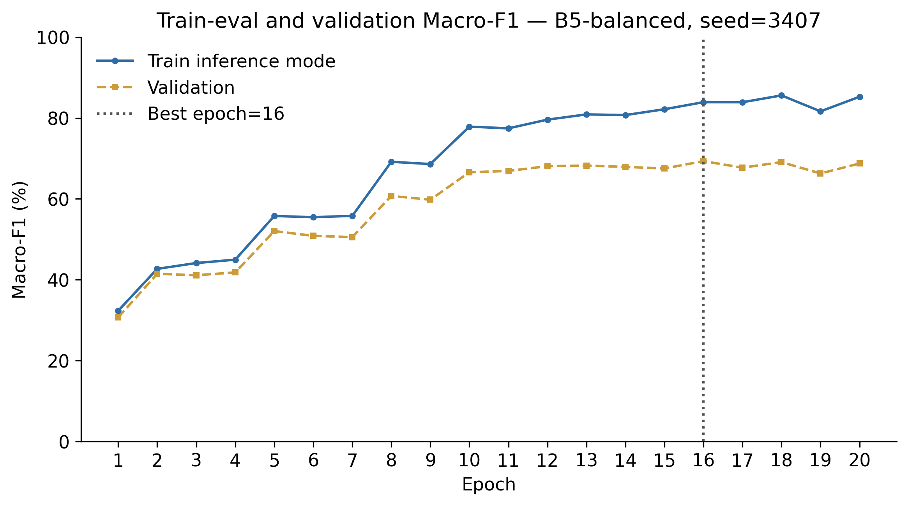
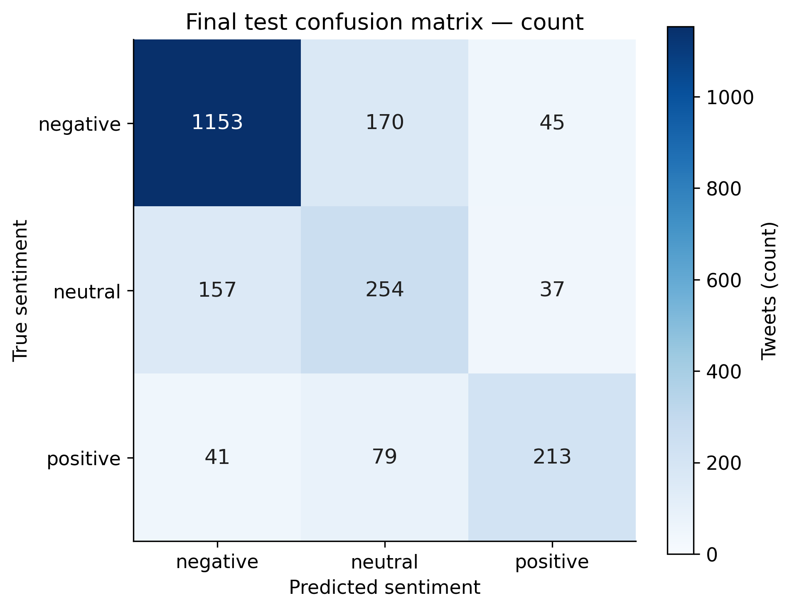

# CHƯƠNG 3. THỰC NGHIỆM VÀ ĐÁNH GIÁ

## 3.1. Phạm vi và môi trường thực tế

Dự án giữ **RNN** làm mô hình chính. Notebook Kaggle dùng LSTM/binary là nguồn tham khảo, không phải cùng kiến trúc với thực nghiệm nhóm. Kết quả dưới đây được sinh từ các run hoàn tất, không có số Accuracy/F1 điền trước.

Môi trường thực thi lần này: macOS-27.2-arm64-arm-64bit; Python 3.12.14; TensorFlow 2.20.0; Keras 3.11.3; CPU arm64, 10 physical cores; RAM 16.0GiB; GPU không có GPU TensorFlow. Float32, deterministic operations; intra/inter threads 2/1. Tổng wall time training các run đăng ký (kể cả full-split metrics từng epoch): 19.91 phút. Thời gian không đại diện Colab GPU.

Notebook và dependencies hỗ trợ chuyển lên Colab; Google Drive dùng lưu artifacts nếu nhóm chọn. **Các kết quả hiện có được chạy trên máy cá nhân**, không ghi nhầm là Colab/T4.

## 3.2. Dataset, exclusions và split

Dataset raw: 14,640tweet, 15cột; SHA-256 `ea94b23f41892b290dec3330bb8cf9cb6b8bc669eaae5f3a84c40f7b0de8f15e`. Input chỉ là text, target sentiment; metadata hãng không làm feature. Duplicate ID raw=155, duplicate raw text=213; các field confidence/gold/reason không đưa vào model.

| benchmark | reason | rows |
| --- | --- | --- |
| binary | exact_duplicate_record | 28 |
| binary | conflicting_labels_in_duplicate_group | 8 |
| three_class | conflicting_labels_in_duplicate_group | 251 |
| three_class | exact_duplicate_record | 36 |

Nhóm duplicate tạo theo tweet ID, raw text chuẩn hóa và clean representation; conflicting-label groups cách ly; exact duplicate records bỏ; các nhóm còn lại không chéo split sạch. A1 giữ split nguồn riêng.

| benchmark | split | negative | positive | total | neutral |
| --- | --- | --- | --- | --- | --- |
| binary_source | test | 1254 | 709 | 1963 | 0 |
| binary_source | train | 2361 | 1301 | 3662 | 0 |
| binary_source | validation | 563 | 353 | 916 | 0 |
| binary_clean | test | 1257 | 709 | 1966 | 0 |
| binary_clean | train | 2321 | 1323 | 3644 | 0 |
| binary_clean | validation | 577 | 318 | 895 | 0 |
| three_class | test | 1368 | 333 | 2149 | 448 |
| three_class | train | 6404 | 1544 | 10043 | 2095 |
| three_class | validation | 1368 | 335 | 2161 | 458 |

Tỷ lệ trên dữ liệu sạch có thể lệch nhẹ70/15/15 do giữ group. Manifest lưu row IDs,group IDs và hashes. Source binary/A2/three-class có population khác nhau nên không so accuracy như cùng benchmark.

## 3.3. Kiến trúc và training protocol

Embedding → SpatialDropout → RNN(tanh) → Dropout → Dense100/ReLU → Dropout → softmax. Word vocabulary train-only ở A2/C0/B; PAD0,OOV1 và marker IDs ở P0; padding được mask ở C0/B. Sparse categorical cross-entropy; Adam LR0.001; batch32;max20epochs. Clean runs checkpoint theo valMacro-F1, ES patience5/min_delta0.001;A1 dùng epochcuối.

| Hyperparameter | Value |
| --- | --- |
| id | B5-balanced |
| benchmark | three_class |
| vocabulary_size | 4000 |
| sequence_length | 40 |
| hidden_units | 196 |
| embedding_dimension | 128 |
| spatial_dropout | 0.5 |
| input_dropout | 0.3 |
| recurrent_dropout | 0.3 |
| output_dropout | 0.2 |
| dense_units | 100 |
| dense_dropout | 0.4 |
| learning_rate | 0.001 |
| batch_size | 32 |
| max_epochs | 20 |
| patience | 5 |
| min_delta | 0.001 |
| class_weighting | balanced |
| gradient_clipnorm | 1.0 |
| early_stopping | True |
| mask_zero | True |

Seeds42,2026,3407 trên cùng split. F1 tính trên toàn validation/train trong inference mode, không trung bình F1 minibatch. Balanced weights chỉ dùng train. Source code/config/split/checkpoint hashes được lưu. Matrix khóa trước test; chọn meanvalMacro-F1. Các config cách max dưới0.005 được ưu tiên ít parameters, sau đó median training time; đây là quy tắc thực dụng, không phải kiểm định tương đương.

Các bảng Accuracy dùng thang phần trăm; SD bên cạnh là điểm phần trăm. Macro-F1 dùng thang0–1. Run đơn hoặc majority baseline không báo SD như một ước lượng độ bất định.

## 3.4. Baseline và controlled experiments

| Configuration | Benchmark | Seeds | Val Accuracy | Val Macro-F1 |
| --- | --- | --- | --- | --- |
| A1 | binary_source | 1 | 84.83% | 0.8376 |
| A2 | binary_clean | 3 | 73.33% ± 11.74 | 0.6421 ± 0.2171 |
| C0 | three_class | 3 | 75.12% ± 0.63 | 0.6623 ± 0.0017 |
| B1-20 | three_class | 3 | 75.69% ± 0.92 | 0.6722 ± 0.0159 |
| B1-60 | three_class | 3 | 75.12% ± 0.63 | 0.6623 ± 0.0017 |
| B3-64 | three_class | 3 | 75.88% ± 0.30 | 0.6625 ± 0.0073 |
| B3-128 | three_class | 3 | 76.21% ± 0.20 | 0.6724 ± 0.0079 |
| B5-balanced | three_class | 3 | 75.21% ± 0.86 | 0.6926 ± 0.0115 |

A1 là adapted pipeline, A2 là clean binary, C0 là clean three-class. B1 thay T20/40/60, B3 thayH64/128/196, B5 thay classweightNone/balanced; mỗi variant khácC0 một factor. Embedding dimensions/dropout/batch/LR/split/budget giữ cố định.

Train token length lớn nhất ở representation cuối là 34. Trong benchmark P0 hiện có, T40 vàT60 không cắt tweet; do đó không diễn giải T60 là giữ thêm context nếu coverage như nhau. Với PAD được mask, đây chủ yếu là đối chứng padding/chi phí; T20 khảo sát truncation. SD là độ biến thiên initialization/shuffle/dropout qua ba training seeds, không phải CI do split khác nhau.

### Bảng B trên validation

| Configuration | Benchmark | Seeds | Val Accuracy | Val Macro-F1 |
| --- | --- | --- | --- | --- |
| C0 | three_class | 3 | 75.12% ± 0.63 | 0.6623 ± 0.0017 |
| B1-20 | three_class | 3 | 75.69% ± 0.92 | 0.6722 ± 0.0159 |
| B1-60 | three_class | 3 | 75.12% ± 0.63 | 0.6623 ± 0.0017 |
| B3-64 | three_class | 3 | 75.88% ± 0.30 | 0.6625 ± 0.0073 |
| B3-128 | three_class | 3 | 76.21% ± 0.20 | 0.6724 ± 0.0079 |
| B5-balanced | three_class | 3 | 75.21% ± 0.86 | 0.6926 ± 0.0115 |

### Phân tích các thay đổi đã đo

A1 đạt test Accuracy 83.80% với RNN, còn nguồn công bố 90.32% với LSTM. Kiến trúc và seed/runtime khác nhau nên chênh lệch này không xác nhận hay bác bỏ khả năng tái lập cùng mô hình nguồn. A2 biến thiên lớn giữa seeds: test Macro-F1 SD=0.2183. Seed42 dừng ở epoch 6, chọn checkpoint epoch 1; F1 positive trên test chỉ 0.0593. Không chọn riêng seed3407 tốt hơn để che biến thiên này; chưa có ablation đủ để quy nguyên nhân cho cleaner, leakage, dropout hoặc ES.

- **Sequence length:** T20 có mean validation Macro-F1 0.6722, so với T40 0.6623. T40 và T60 cho cùng validation metrics ở cả ba seeds trong lần chạy này; median wall time lần lượt 76.5s và 108.9s. Khi không có thêm token cần giữ và PAD được mask, T60 chỉ tăng chi phí ở setup này.
- **Hidden units:** H64/H128/H196 có mean validation Macro-F1 lần lượt 0.6625/0.6724/0.6623. Tăng H không tạo cải thiện đơn điệu; cần đọc cùng số parameters và thời gian F21.
- **Class weighting:** balanced tăng mean validation Macro-F1 từ 0.6623 lên 0.6926. Đây là cấu hình được chọn bằng validation. Ba seeds chưa đủ để khẳng định statistical significance.

Không tự ghép các mức thắng. Config được chọn thực sự đã chạy: **B5-balanced**. Seed demo=3407, chọn validation Macro-F1 trung vị trước khi xem test. Nếu config khác có meanvalF1 nhỉnh hơn trong tolerance, việc ưu tiên model nhỏ hơn tuân theo quy tắc đặt trước.

## 3.5. Đánh giá cuối trên test

Test chỉ mở sau selection; A1/A2/C0/winner được đánh giá trong benchmark riêng. Các ablation khác không có test metric theo protocol.

| Configuration | Benchmark | Seeds | Test Accuracy | Test Macro-F1 |
| --- | --- | --- | --- | --- |
| A1 | binary_source | 1 | 83.80% | 0.8249 |
| A2 | binary_clean | 3 | 74.08% ± 11.12 | 0.6531 ± 0.2183 |
| C0 | three_class | 3 | 74.75% ± 0.63 | 0.6515 ± 0.0017 |
| B5-balanced | three_class | 3 | 75.18% ± 1.34 | 0.6914 ± 0.0158 |
| majority | binary_source | 1 | 63.88% | 0.3898 |
| majority | binary_clean | 1 | 63.94% | 0.3900 |
| majority | three_class | 1 | 63.66% | 0.2593 |

Mô hình cuối B5-balanced: testAccuracy mean=75.18%, SD=1.34%; testMacro-F1 mean=69.14%, SD=1.58%. Đây là mean±SD qua training seeds trên cùng holdout.

### Per-class của checkpoint dùng demo (seed 3407)

| sentiment | precision | recall | f1-score | support |
| --- | --- | --- | --- | --- |
| negative | 0.8534 | 0.8428 | 0.8481 | 1368 |
| neutral | 0.5050 | 0.5670 | 0.5342 | 448 |
| positive | 0.7220 | 0.6396 | 0.6783 | 333 |

Per-class/CM/hình ví dụ tương ứng checkpoint seed trung vị, không thay mean±SD tổng thể. Majority baseline lấy prior/lớp phổ biến từ train; không học nhãn test. Cần xem Macro-F1 và per-class recall cùng Accuracy vì negative chiếm đa số.

### Đối chiếu F1 từng lớp giữa C0 và cấu hình cuối

| config_id | sentiment | f1_mean | f1_std | seeds |
| --- | --- | --- | --- | --- |
| C0 | negative | 0.8596 | 0.0035 | 3 |
| C0 | neutral | 0.4754 | 0.0139 | 3 |
| C0 | positive | 0.6196 | 0.0132 | 3 |
| B5-balanced | negative | 0.8438 | 0.0073 | 3 |
| B5-balanced | neutral | 0.5410 | 0.0334 | 3 |
| B5-balanced | positive | 0.6895 | 0.0118 | 3 |

F1 trung bình C0 → cấu hình cuối: negative: 0.8596 → 0.8438; neutral: 0.4754 → 0.5410; positive: 0.6196 → 0.6895. Đây là tradeoff quan sát trên test sau khi selection đã khóa, không dùng để quay lại chọn model.

## 3.6. Hội tụ và phân tích lỗi

HìnhF11/F12/F13 lấy history thật;bestepoch=16;epochs chạy=20;stopreason=max_epochs. Trainfitloss có dropout/weighting;train_evalF1/valF1 dùng inference mode. Không coi chúng là cùng chế độ tính.

Phân tích chi tiết và số nhầm từng lớp ở `error_analysis.md`. Review cases ởCSV có cột cho hai người đánh dấu. Chưa có annotation sarcasm được con người xác minh; chưa có preprocessing ablation chứng minh ảnh hưởng cleaning lên metric. Không tạo kết luận trước hoặc gán nguyên nhân từ một vài ví dụ.

## 3.7. Đối chiếu nguồn và hạn chế

Nguồn báo testAccuracy90.32% của LSTM trên6.541tweet/two-class, vocabulary fitted before split, epoch20. RNN nhóm đổi recurrent mechanism;A2/C0 thay protocol/population. Chênh lệch số không phải một phép so sánh công bằng hoặc bằng chứng riêng về leakage. Source audit ghi rõ các khác biệt, và không công bố “đã tái lập LSTM90%”.

Giới hạn: một split cố định;ba seeds không thay cross-validation;duplicate/conflict policy thay population;class-weighting có thể đổi tradeoff;dropout kế thừa nguồn khá mạnh;max20epoch/ES là budget đã khóa;tiếng Anh/tweet airline có domain hạn chế;softmax chưacalibration;CPUtime không so thẳng vớiGPU. B1T40/T60 không khảo sát thêm ngữ cảnh khi không tweet nào dài vượt40tokens.

Future work: manualreview sâu;preprocessing/learningrate/gradient clipping ablation và logging để kiểm tra giả thuyếtgradient;benchmark airline/time riêng;uncertainty bằngbootstrap nhómduplicate. LSTM/GRU/Transformer chỉ là comparator mở rộng riêng nếu nhóm duyệt.

## Tài liệu và artifacts

- [Notebook nguồn](https://www.kaggle.com/code/chibuzorokocha/airline-sentiment-analysis-90-accuracy-using-rnn) và [dataset](https://www.kaggle.com/datasets/crowdflower/twitter-airline-sentiment).
- `results/tables/`: bảng đầu vào báo cáo; `results/metrics/`: metrics/classification reports; `results/figures/manifest.json`: caption scope/purpose; `models/final/`: inference bundle.
- README hướng dẫn rerun và kiểm tra integrity. Không dùng test để tiếp tục tuning sau chương này.
